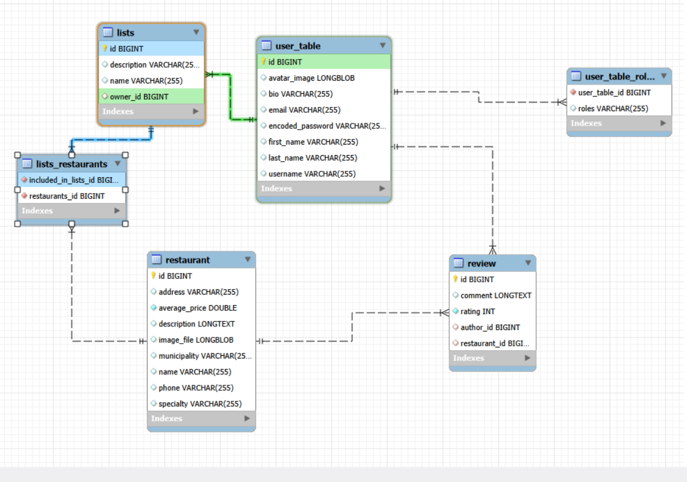
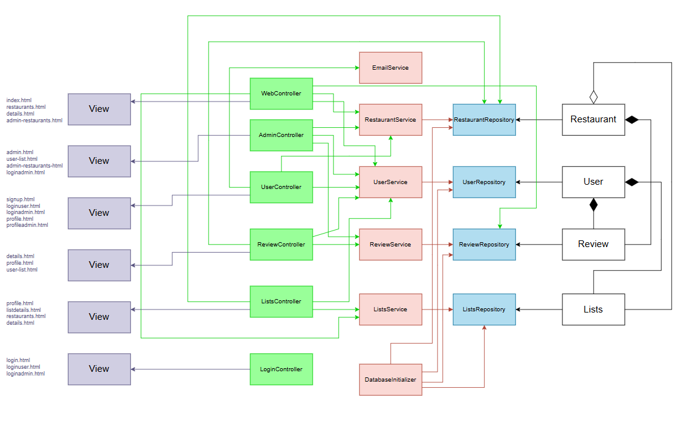

# Celis&Ud

## 👥 Miembros del Equipo
| Nombre y Apellidos | Correo URJC | Usuario GitHub |
|:--- |:--- |:--- |
| Sara Torres García | s.torresg.2017@alumnos.urjc.es | saratorres99 |
| Alexis Maestro López | a.maestro.2023@alumnos.urjc.es | alexissmaestroo |
| Diego Iglesias Peña | d.iglesias.2023@alumnos.urjc.es | diegoigle3 |
| Rodrigo de Frutos Suárez| r.defrutos.2023@alumnos.urjc.es | rodrigodefrutos |

---

## 🎭 **Preparación: Definición del Proyecto**

### **Descripción del Tema**
Esta aplicación web es un buscador colaborativo de restaurantes especializados en oferta **sin gluten**, diseñado para facilitar la vida social y gastronómica del colectivo celíaco. La plataforma organiza la información geográficamente por **municipios**, permitiendo a los usuarios localizar de forma rápida establecimientos seguros en su localidad específica. El valor diferencial de la aplicación reside en la confianza de la comunidad: los usuarios no solo consultan, sino que validan la seguridad y calidad de los restaurantes mediante un sistema de reseñas y valoraciones, creando así un directorio fiable y actualizado de zonas seguras para comer.

### **Entidades**
Indicar las entidades principales que gestionará la aplicación y las relaciones entre ellas:

1. **Usuario**: Personas que utilizan la aplicación para buscar o valorar sitios.
2. **Restaurante**: Los establecimientos que ofrecen comida apta para celíacos.
3. **Reseña**: La valoración (estrellas) y comentario que deja un usuario sobre su experiencia.
4. **Municipio**: La localidad donde se agrupan los restaurantes (Ej: Madrid, Móstoles, Alcorcón).

**Relaciones entre entidades:**
- **Usuario - Reseña**: Un usuario puede escribir múltiples reseñas, pero una reseña pertenece a un único autor (1:N).
- **Restaurante - Reseña**: Un restaurante puede recibir múltiples reseñas de distintos usuarios (1:N).
- **Restaurante - Municipio**: Un restaurante pertenece físicamente a un único municipio, pero un municipio contiene muchos restaurantes (N:1).
- **Usuario - Restaurante**: Un usuario puede guardar múltiples restaurantes como favoritos y un restaurante puede ser guardado por múltiples usuarios (N:M).

### **Permisos de los Usuarios**
Describir los permisos de cada tipo de usuario e indicar de qué entidades es dueño:

* **Usuario Anónimo**: 
  - Permisos: Visualizar listado de municipios, buscar restaurantes, ver detalles y leer reseñas.
  - No es dueño de ninguna entidad.

* **Usuario Registrado**: 
  - Permisos: Todo lo anterior + Publicar reseñas, gestionar su perfil, guardar favoritos.
  - Es dueño de: Su **Perfil de Usuario** y sus propias **Reseñas**.

* **Administrador**: 
  - Permisos: Crear, editar y borrar Restaurantes (CRUD), gestionar Municipios (crear nuevas zonas), moderar reseñas ofensivas y bloquear usuarios.
  - Es dueño de: **Restaurantes**, **Municipios** y la gestión global de la plataforma.

### **Imágenes**
Indicar qué entidades tendrán asociadas una o varias imágenes:

- **Usuario**: Una imagen de avatar por usuario.
- **Restaurante**: Una imagen de portada del establecimiento.
- **Municipio**: Una imagen representativa de la ciudad (Ej: Plaza Mayor para Madrid) para mostrar en las tarjetas de búsqueda.

### **Gráficos**
Indicar qué información se mostrará usando gráficos y de qué tipo serán:

- **Gráfico 1**: Top 5 Restaurantes mejor valorados de la plataforma - Gráfico de barras.
- **Gráfico 2**: Distribución de restaurantes por Municipio (Ej: % en Madrid vs Móstoles) - Gráfico de tarta/circular.
- **Gráfico 3**: Evolución de reseñas publicadas en el último año - Gráfico de líneas.

### **Tecnología Complementaria**
Indicar qué tecnología complementaria se empleará:

- Generación de PDFs de la "Ficha de Seguridad" del restaurante (con dirección y alérgenos) para descargar.
- Envío de correos electrónicos automáticos de bienvenida al registrarse.

### **Algoritmo o Consulta Avanzada**
Indicar cuál será el algoritmo o consulta avanzada que se implementará:

- **Algoritmo/Consulta**: Ranking de "Restaurantes Seguros por Zona".
- **Descripción**: El sistema filtra los restaurantes por el **Municipio** seleccionado y los ordena calculando un índice de calidad. Este índice pondera la **valoración media** (estrellas) con la **cantidad total de reseñas**, priorizando aquellos sitios que tienen muchas opiniones positivas frente a los que tienen pocas aunque sean buenas (para evitar falsos positivos).

---

## 🛠 **Práctica 1: Maquetación de páginas web con HTML y CSS**

### **Diagrama de Navegación**
Diagrama que muestra cómo se navega entre las diferentes páginas de la aplicación:


> [Descripción opcional del flujo de navegación: Ej: "El usuario puede acceder desde la página principal a todas las secciones mediante el menú de navegación. Los usuarios anónimos solo tienen acceso a las páginas públicas, mientras que los registrados pueden acceder a su perfil y panel de usuario."]

### **Capturas de Pantalla y Descripción de Páginas**

#### **1. Página Principal / Home**


> [Descripción breve: Ej: "Página de inicio que muestra los productos destacados, categorías principales y un banner promocional. Incluye barra de navegación y acceso a registro/login para usuarios no autenticados."]

#### **AQUÍ AÑADIR EL RESTO DE PÁGINAS**

### **Participación de Miembros en la Práctica 1**

#### **Alumno 1 - [Nombre Completo]**

[Descripción de las tareas y responsabilidades principales del alumno en el proyecto]

| Nº    | Commits      | Files      |
|:------------: |:------------:| :------------:|
|1| [Descripción commit 1](URL_commit_1)  | [Archivo1](URL_archivo_1)   |
|2| [Descripción commit 2](URL_commit_2)  | [Archivo2](URL_archivo_2)   |
|3| [Descripción commit 3](URL_commit_3)  | [Archivo3](URL_archivo_3)   |
|4| [Descripción commit 4](URL_commit_4)  | [Archivo4](URL_archivo_4)   |
|5| [Descripción commit 5](URL_commit_5)  | [Archivo5](URL_archivo_5)   |

---

#### **Alumno 2 - [Nombre Completo]**

[Descripción de las tareas y responsabilidades principales del alumno en el proyecto]

| Nº    | Commits      | Files      |
|:------------: |:------------:| :------------:|
|1| [Descripción commit 1](URL_commit_1)  | [Archivo1](URL_archivo_1)   |
|2| [Descripción commit 2](URL_commit_2)  | [Archivo2](URL_archivo_2)   |
|3| [Descripción commit 3](URL_commit_3)  | [Archivo3](URL_archivo_3)   |
|4| [Descripción commit 4](URL_commit_4)  | [Archivo4](URL_archivo_4)   |
|5| [Descripción commit 5](URL_commit_5)  | [Archivo5](URL_archivo_5)   |

---

#### **Alumno 3 - [Nombre Completo]**

[Descripción de las tareas y responsabilidades principales del alumno en el proyecto]

| Nº    | Commits      | Files      |
|:------------: |:------------:| :------------:|
|1| [Descripción commit 1](URL_commit_1)  | [Archivo1](URL_archivo_1)   |
|2| [Descripción commit 2](URL_commit_2)  | [Archivo2](URL_archivo_2)   |
|3| [Descripción commit 3](URL_commit_3)  | [Archivo3](URL_archivo_3)   |
|4| [Descripción commit 4](URL_commit_4)  | [Archivo4](URL_archivo_4)   |
|5| [Descripción commit 5](URL_commit_5)  | [Archivo5](URL_archivo_5)   |

---

#### **Alumno 4 - [Nombre Completo]**

[Descripción de las tareas y responsabilidades principales del alumno en el proyecto]

| Nº    | Commits      | Files      |
|:------------: |:------------:| :------------:|
|1| [Descripción commit 1](URL_commit_1)  | [Archivo1](URL_archivo_1)   |
|2| [Descripción commit 2](URL_commit_2)  | [Archivo2](URL_archivo_2)   |
|3| [Descripción commit 3](URL_commit_3)  | [Archivo3](URL_archivo_3)   |
|4| [Descripción commit 4](URL_commit_4)  | [Archivo4](URL_archivo_4)   |
|5| [Descripción commit 5](URL_commit_5)  | [Archivo5](URL_archivo_5)   |

---

## 🛠 **Práctica 2: Web con HTML generado en servidor**

### **Navegación y Capturas de Pantalla**

#### **Diagrama de Navegación**

Solo si ha cambiado.

#### **Capturas de Pantalla Actualizadas**

Solo si han cambiado.

### **Instrucciones de Ejecución**

#### **Requisitos Previos**
- **Java**: versión 21 o superior
- **Maven**: versión 3.8 o superior
- **MySQL**: versión 8.0 o superior
- **Git**: para clonar el repositorio

#### **Pasos para ejecutar la aplicación**

1. **Clonar el repositorio**
   ```bash
   git clone https://github.com/[usuario]/[nombre-repositorio].git
   cd [nombre-repositorio]
   ```

2. **AQUÍ INDICAR LO SIGUIENTES PASOS**

#### **Credenciales de prueba**
- **Usuario Admin**: usuario: `admin`, contraseña: `admin`
- **Usuario Registrado**: usuario: `user`, contraseña: `user`

### **Diagrama de Entidades de Base de Datos**

Diagrama mostrando las entidades, sus campos y relaciones:



> [Descripción opcional: Ej: "El diagrama muestra las 4 entidades principales: Usuario, Producto, Pedido y Categoría, con sus respectivos atributos y relaciones 1:N y N:M."]

### **Diagrama de Clases y Templates**

Diagrama de clases de la aplicación con diferenciación por colores o secciones:



> [Descripción opcional del diagrama y relaciones principales]

### **Participación de Miembros en la Práctica 2**

#### **Alumno 1 - [Nombre Completo]**

[Descripción de las tareas y responsabilidades principales del alumno en el proyecto]

| Nº    | Commits      | Files      |
|:------------: |:------------:| :------------:|
|1| [Descripción commit 1](URL_commit_1)  | [Archivo1](URL_archivo_1)   |
|2| [Descripción commit 2](URL_commit_2)  | [Archivo2](URL_archivo_2)   |
|3| [Descripción commit 3](URL_commit_3)  | [Archivo3](URL_archivo_3)   |
|4| [Descripción commit 4](URL_commit_4)  | [Archivo4](URL_archivo_4)   |
|5| [Descripción commit 5](URL_commit_5)  | [Archivo5](URL_archivo_5)   |

---

#### **Alumno 2 - [Nombre Completo]**

[Descripción de las tareas y responsabilidades principales del alumno en el proyecto]

| Nº    | Commits      | Files      |
|:------------: |:------------:| :------------:|
|1| [Descripción commit 1](URL_commit_1)  | [Archivo1](URL_archivo_1)   |
|2| [Descripción commit 2](URL_commit_2)  | [Archivo2](URL_archivo_2)   |
|3| [Descripción commit 3](URL_commit_3)  | [Archivo3](URL_archivo_3)   |
|4| [Descripción commit 4](URL_commit_4)  | [Archivo4](URL_archivo_4)   |
|5| [Descripción commit 5](URL_commit_5)  | [Archivo5](URL_archivo_5)   |

---

#### **Alumno 3 - [Nombre Completo]**

[Descripción de las tareas y responsabilidades principales del alumno en el proyecto]

| Nº    | Commits      | Files      |
|:------------: |:------------:| :------------:|
|1| [Descripción commit 1](URL_commit_1)  | [Archivo1](URL_archivo_1)   |
|2| [Descripción commit 2](URL_commit_2)  | [Archivo2](URL_archivo_2)   |
|3| [Descripción commit 3](URL_commit_3)  | [Archivo3](URL_archivo_3)   |
|4| [Descripción commit 4](URL_commit_4)  | [Archivo4](URL_archivo_4)   |
|5| [Descripción commit 5](URL_commit_5)  | [Archivo5](URL_archivo_5)   |

---

#### **Alumno 4 - [Nombre Completo]**

[Descripción de las tareas y responsabilidades principales del alumno en el proyecto]

| Nº    | Commits      | Files      |
|:------------: |:------------:| :------------:|
|1| [Descripción commit 1](URL_commit_1)  | [Archivo1](URL_archivo_1)   |
|2| [Descripción commit 2](URL_commit_2)  | [Archivo2](URL_archivo_2)   |
|3| [Descripción commit 3](URL_commit_3)  | [Archivo3](URL_archivo_3)   |
|4| [Descripción commit 4](URL_commit_4)  | [Archivo4](URL_archivo_4)   |
|5| [Descripción commit 5](URL_commit_5)  | [Archivo5](URL_archivo_5)   |

---

## 🛠 **Práctica 3: API REST, docker y despliegue**

### **Documentación de la API REST**

#### **Especificación OpenAPI**
📄 **[Especificación OpenAPI (YAML)](/api-docs/api-docs.yaml)**

#### **Documentación HTML**
📖 **[Documentación API REST (HTML)](https://raw.githack.com/[usuario]/[repositorio]/main/api-docs/api-docs.html)**

> La documentación de la API REST se encuentra en la carpeta `/api-docs` del repositorio. Se ha generado automáticamente con SpringDoc a partir de las anotaciones en el código Java.

### **Diagrama de Clases y Templates Actualizado**

Diagrama actualizado incluyendo los @RestController y su relación con los @Service compartidos:


### **Instrucciones de Ejecución con Docker**

#### **Requisitos previos:**
- Docker instalado (versión 20.10 o superior)
- Docker Compose instalado (versión 2.0 o superior)

#### **Pasos para ejecutar con docker-compose:**

1. **Clonar el repositorio** (si no lo has hecho ya):
   ```bash
   git clone https://github.com/[usuario]/[repositorio].git
   cd [repositorio]
   ```

2. **AQUÍ LOS SIGUIENTES PASOS**:

### **Construcción de la Imagen Docker**

#### **Requisitos:**
- Docker instalado en el sistema

#### **Pasos para construir y publicar la imagen:**

1. **Navegar al directorio de Docker**:
   ```bash
   cd docker
   ```

2. **AQUÍ LOS SIGUIENTES PASOS**

### **Despliegue en Máquina Virtual**

#### **Requisitos:**
- Acceso a la máquina virtual (SSH)
- Clave privada para autenticación
- Conexión a la red correspondiente o VPN configurada

#### **Pasos para desplegar:**

1. **Conectar a la máquina virtual**:
   ```bash
   ssh -i [ruta/a/clave.key] [usuario]@[IP-o-dominio-VM]
   ```
   
   Ejemplo:
   ```bash
   ssh -i ssh-keys/app.key vmuser@10.100.139.XXX
   ```

2. **AQUÍ LOS SIGUIENTES PASOS**:

### **URL de la Aplicación Desplegada**

🌐 **URL de acceso**: `https://[nombre-app].etsii.urjc.es:8443`

#### **Credenciales de Usuarios de Ejemplo**

| Rol | Usuario | Contraseña |
|:---|:---|:---|
| Administrador | admin | admin123 |
| Usuario Registrado | user1 | user123 |
| Usuario Registrado | user2 | user123 |

### **OTRA DOCUMENTACIÓN ADICIONAL REQUERIDA EN LA PRÁCTICA**

### **Participación de Miembros en la Práctica 3**

#### **Alumno 1 - [Nombre Completo]**

[Descripción de las tareas y responsabilidades principales del alumno en el proyecto]

| Nº    | Commits      | Files      |
|:------------: |:------------:| :------------:|
|1| [Descripción commit 1](URL_commit_1)  | [Archivo1](URL_archivo_1)   |
|2| [Descripción commit 2](URL_commit_2)  | [Archivo2](URL_archivo_2)   |
|3| [Descripción commit 3](URL_commit_3)  | [Archivo3](URL_archivo_3)   |
|4| [Descripción commit 4](URL_commit_4)  | [Archivo4](URL_archivo_4)   |
|5| [Descripción commit 5](URL_commit_5)  | [Archivo5](URL_archivo_5)   |

---

#### **Alumno 2 - [Nombre Completo]**

[Descripción de las tareas y responsabilidades principales del alumno en el proyecto]

| Nº    | Commits      | Files      |
|:------------: |:------------:| :------------:|
|1| [Descripción commit 1](URL_commit_1)  | [Archivo1](URL_archivo_1)   |
|2| [Descripción commit 2](URL_commit_2)  | [Archivo2](URL_archivo_2)   |
|3| [Descripción commit 3](URL_commit_3)  | [Archivo3](URL_archivo_3)   |
|4| [Descripción commit 4](URL_commit_4)  | [Archivo4](URL_archivo_4)   |
|5| [Descripción commit 5](URL_commit_5)  | [Archivo5](URL_archivo_5)   |

---

#### **Alumno 3 - [Nombre Completo]**

[Descripción de las tareas y responsabilidades principales del alumno en el proyecto]

| Nº    | Commits      | Files      |
|:------------: |:------------:| :------------:|
|1| [Descripción commit 1](URL_commit_1)  | [Archivo1](URL_archivo_1)   |
|2| [Descripción commit 2](URL_commit_2)  | [Archivo2](URL_archivo_2)   |
|3| [Descripción commit 3](URL_commit_3)  | [Archivo3](URL_archivo_3)   |
|4| [Descripción commit 4](URL_commit_4)  | [Archivo4](URL_archivo_4)   |
|5| [Descripción commit 5](URL_commit_5)  | [Archivo5](URL_archivo_5)   |

---

#### **Alumno 4 - [Nombre Completo]**

[Descripción de las tareas y responsabilidades principales del alumno en el proyecto]

| Nº    | Commits      | Files      |
|:------------: |:------------:| :------------:|
|1| [Descripción commit 1](URL_commit_1)  | [Archivo1](URL_archivo_1)   |
|2| [Descripción commit 2](URL_commit_2)  | [Archivo2](URL_archivo_2)   |
|3| [Descripción commit 3](URL_commit_3)  | [Archivo3](URL_archivo_3)   |
|4| [Descripción commit 4](URL_commit_4)  | [Archivo4](URL_archivo_4)   |
|5| [Descripción commit 5](URL_commit_5)  | [Archivo5](URL_archivo_5)   |

---
