# Celis&Ud

## 👥 Miembros del Equipo
| Nombre y Apellidos | Correo URJC | Usuario GitHub |
|:--- |:--- |:--- |
| Sara Torres García | s.torresg.2017@alumnos.urjc.es | saratorres99 |
| Alexis Maestro López | a.maestro.2023@alumnos.urjc.es | alexissmaestroo |
| Diego Iglesias Peña | d.iglesias.2023@alumnos.urjc.es | diegoigle3 |
| Rodrigo de Frutos Suárez| r.defrutos.2023@alumnos.urjc.es | rodrigodefrutos |

---

## 🎭 **Preparación: Definición del Proyecto**

### **Descripción del Tema**
Esta aplicación web es un buscador colaborativo de restaurantes especializados en oferta **sin gluten**, diseñado para facilitar la vida social y gastronómica del colectivo celíaco. La plataforma organiza la información geográficamente por **municipios**, permitiendo a los usuarios localizar de forma rápida establecimientos seguros en su localidad específica. El valor diferencial de la aplicación reside en la confianza de la comunidad: los usuarios no solo consultan, sino que validan la seguridad y calidad de los restaurantes mediante un sistema de reseñas y valoraciones, creando así un directorio fiable y actualizado de zonas seguras para comer.

### **Entidades**
Indicar las entidades principales que gestionará la aplicación y las relaciones entre ellas:

1. **Usuario**: Personas que utilizan la aplicación para buscar o valorar sitios.
2. **Restaurante**: Los establecimientos que ofrecen comida apta para celíacos.
3. **Reseña**: La valoración (estrellas) y comentario que deja un usuario sobre su experiencia.
4. **Lista**: Agrupaciones temáticas creadas por los usuarios (Ej: "Mis sitios top para cenar", "Terrazas sin gluten").

**Relaciones entre entidades:**
- **Usuario - Reseña**: Un usuario puede escribir múltiples reseñas, pero una reseña pertenece a un único autor (1:N).
- **Restaurante - Reseña**: Un restaurante puede recibir múltiples reseñas de distintos usuarios (1:N).
- **Usuario - Lista**: Un usuario puede crear muchas listas personales, pero cada lista pertenece a un "dueño" (propietario) (1:N).
- **Lista - Restaurante**: Una lista puede contener muchos restaurantes (ej: la lista "Favoritos" tiene 10 locales) y un mismo restaurante puede aparecer en las listas de muchos usuarios diferentes (N:M).
- **Usuario - Restaurante**: Un usuario puede guardar múltiples restaurantes como favoritos y un restaurante puede ser guardado por múltiples usuarios (N:M).

### **Permisos de los Usuarios**
Describir los permisos de cada tipo de usuario e indicar de qué entidades es dueño:

* **Usuario Anónimo**: 
  - Permisos: Visualizar listado de municipios, buscar restaurantes, ver detalles y leer reseñas.
  - No es dueño de ninguna entidad.

* **Usuario Registrado**: 
  - Permisos: Todo lo anterior + Publicar reseñas, gestionar su perfil, guardar favoritos.
  - Es dueño de: Su **Perfil de Usuario** y sus propias **Reseñas**.

* **Administrador**: 
  - Permisos: Crear, editar y borrar Restaurantes (CRUD), gestionar Municipios (crear nuevas zonas), moderar reseñas ofensivas y bloquear usuarios.
  - Es dueño de: **Restaurantes**, **Municipios** y la gestión global de la plataforma.

### **Imágenes**
Indicar qué entidades tendrán asociadas una o varias imágenes:

- **Usuario**: Una imagen de avatar por usuario.
- **Restaurante**: Una imagen de portada del establecimiento.
- **Municipio**: Una imagen representativa de la ciudad (Ej: Plaza Mayor para Madrid) para mostrar en las tarjetas de búsqueda.

### **Gráficos**
Indicar qué información se mostrará usando gráficos y de qué tipo serán:

- **Gráfico 1**: Top 5 Restaurantes mejor valorados de la plataforma - Gráfico de barras.
- **Gráfico 2**: Distribución de restaurantes por Municipio (Ej: % en Madrid vs Móstoles) - Gráfico de tarta/circular.
- **Gráfico 3**: Evolución de reseñas publicadas en el último año - Gráfico de líneas.

### **Tecnología Complementaria**
Indicar qué tecnología complementaria se empleará:

- Generación de PDFs de la "Ficha de Seguridad" del restaurante (con dirección y alérgenos) para descargar.
- Envío de correos electrónicos automáticos de bienvenida al registrarse.

### **Algoritmo o Consulta Avanzada**
Indicar cuál será el algoritmo o consulta avanzada que se implementará:

- **Algoritmo/Consulta**: Ranking de "Restaurantes Seguros por Zona".
- **Descripción**: El sistema filtra los restaurantes por el **Municipio** seleccionado y los ordena calculando un índice de calidad. Este índice pondera la **valoración media** (estrellas) con la **cantidad total de reseñas**, priorizando aquellos sitios que tienen muchas opiniones positivas frente a los que tienen pocas aunque sean buenas (para evitar falsos positivos).

---

## 🛠 **Práctica 1: Maquetación de páginas web con HTML y CSS**

### **Diagrama de Navegación**
Diagrama que muestra cómo se navega entre las diferentes páginas de la aplicación:

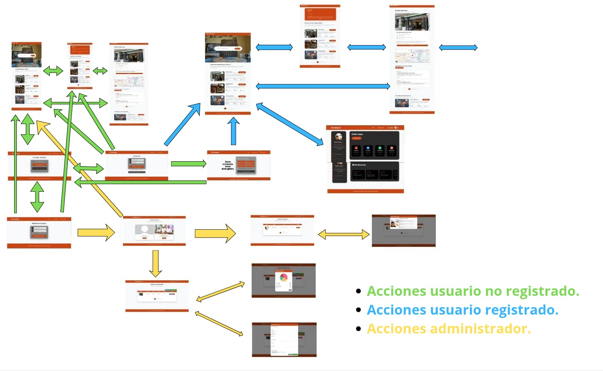


### **Capturas de Pantalla y Descripción de Páginas**

#### **1. Página Principal / index**
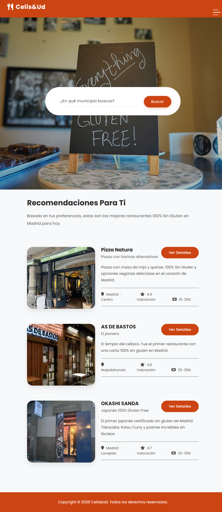

> Página principal de Celis&Ud. Permite buscar los restaurantes e iniciar sesión

#### **2. Página Principal Con Sesión Iniciada / index_user**
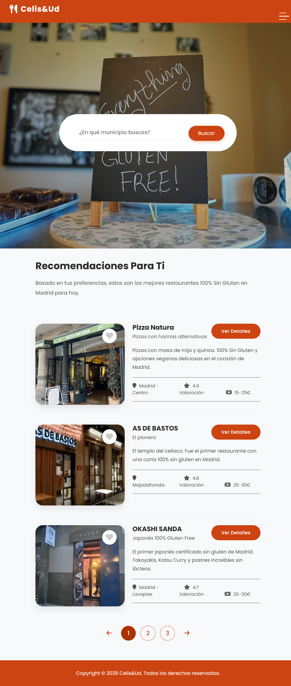

> Página principal con los privilegios de tener una cuenta(poner reseñas y guardar restaurantes favoritos)

#### **3. Página del listado de restaurantes/ restaurants**
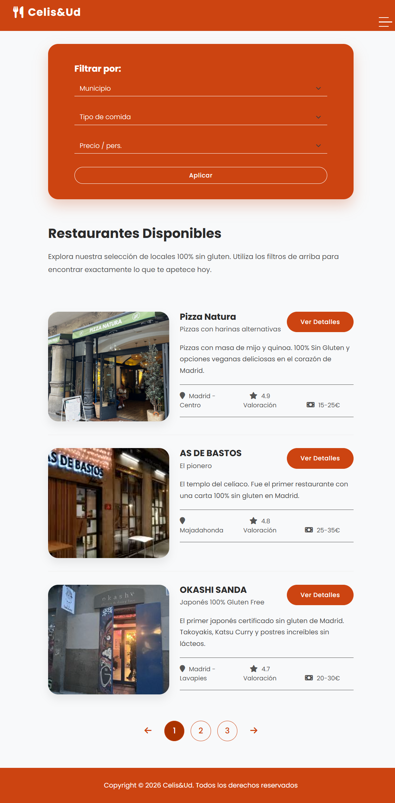

> Página que muestra el listado de restaurantes. Permite filtrar restaurantes por ubicación,tipo de comida y precio

#### **4. Página del listado de restaurantes con sesión iniciada / restaurants_user**


> Listado de restaurantes con privilegios de tener cuenta.

#### **5. Detalles del restaurante / details**


> Página que muestra los detalles del restaurante "Pizza Natura". Permite ver su ubicación y sus reseñas. Además muestra sugerencias de otros restaurantes que pueden interesar al usuario.

#### **6. Detalles del restaurante con sesión iniciada/ details_user**
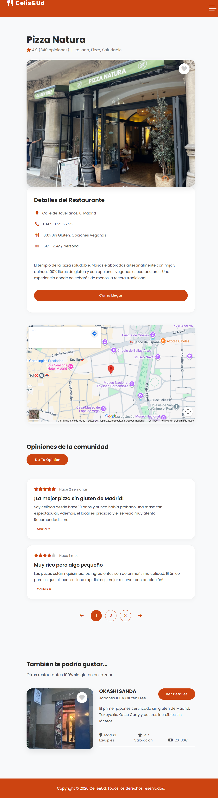

> Pagina de detalles con privilegios de tener cuenta.


#### **7. Panel principal de administración / Admin-Index**
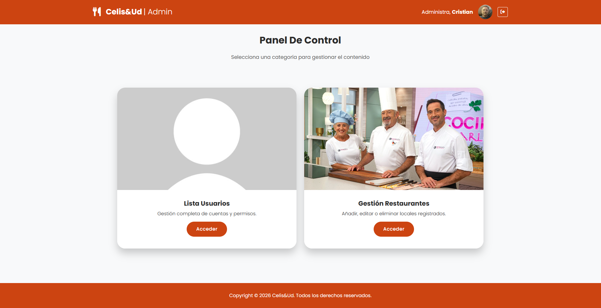

> Página de inicio de los administradores que muestra en el header quién ha iniciado sesión y todas las opciones de gestión que puede hacer el administrador.

#### **8. Listado de restaurantes / Admin-Restaurants**
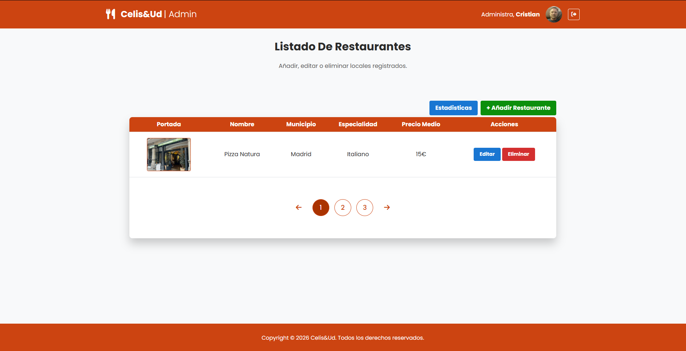

> Página de listado de restaurantes dónde se muestran todos los restaurantes registrados en la base de datos. Se incluyen botones de acción individuales para editar y eliminar el registro, así como botones superiores para añadir nuevos restaurantes y ver estadísticas.

#### **9. Formulario de restaurantes / Restaurant form**
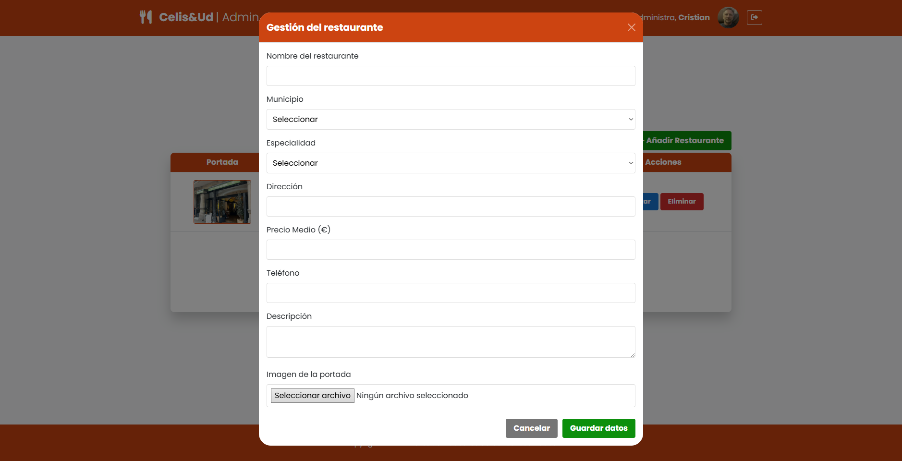

> Formulario para añadir restaurantes al darle a los botones de acción de añadir o editar  restaurantes.

#### **10. Estadisticas de restaurantes / Restaurant statitics**
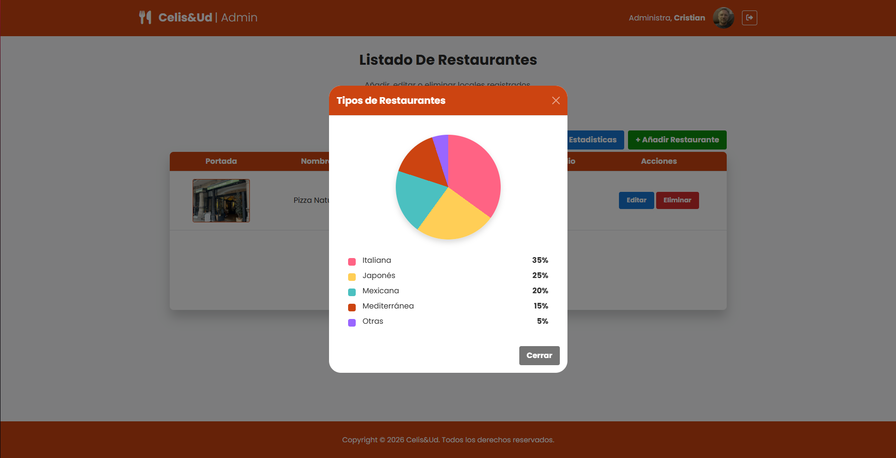

> Gráficos con diferentes estadísticas de los restaurantes, como por ejemplo el porcentaje de restaurantes que hay de cada especialidad.

#### **11. Gestión de usuarios / User management**
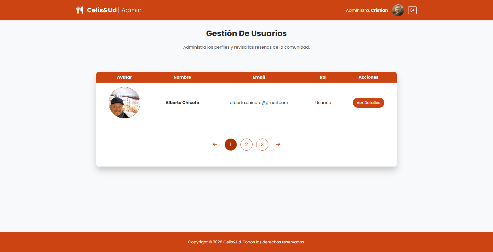

> Página de gestión de usuarios donde se muestra una lista con todos los usuarios registrados en la base de datos. Se incluye un botón de acción para ver mas detalles de cada usuario como por ejemplo las reseñas.

#### **12. Listado de reseñas / Reviews**
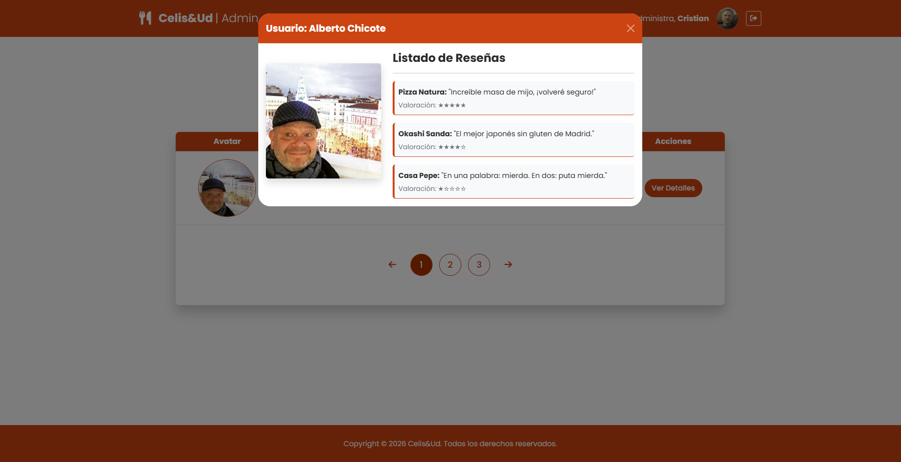

> Menú que se muestra al darle al botón de acción de ver detalles a un usuario del listado de usuarios. Se muestran todas las reseñas hechas por dicho usuario dónde se podrán gestionar.

#### **13. Página de inicio**
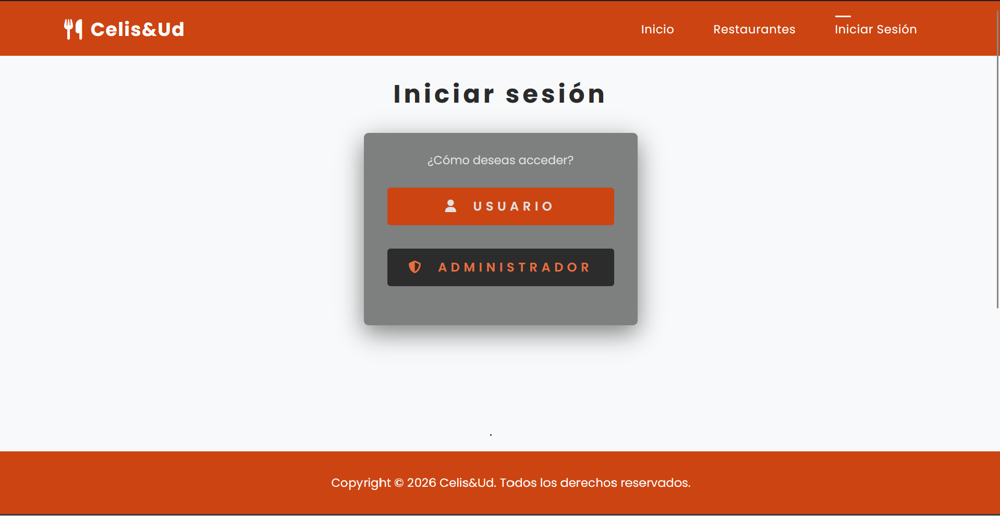

> Página que muestra a la persona un panel para elegir si quiere entrar en la página como usuario o como administrador.

#### **14. Página de inicio usuario**
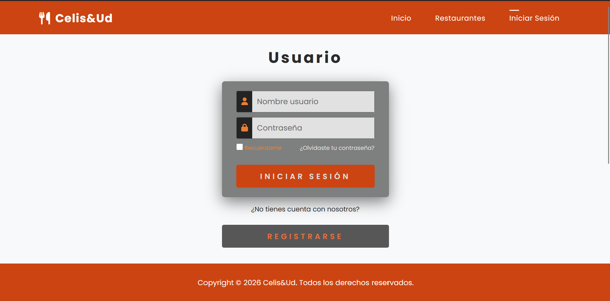

> Página que muestra al usuario un espacio para meter sus credenciales y si quiere ser recordado o si ha olvidado su contraseña.
Igualmente se encuentra un boton por si eres un nuevo usuario y quieres registrarte en la página.

#### **15. Página de inicio administrador**
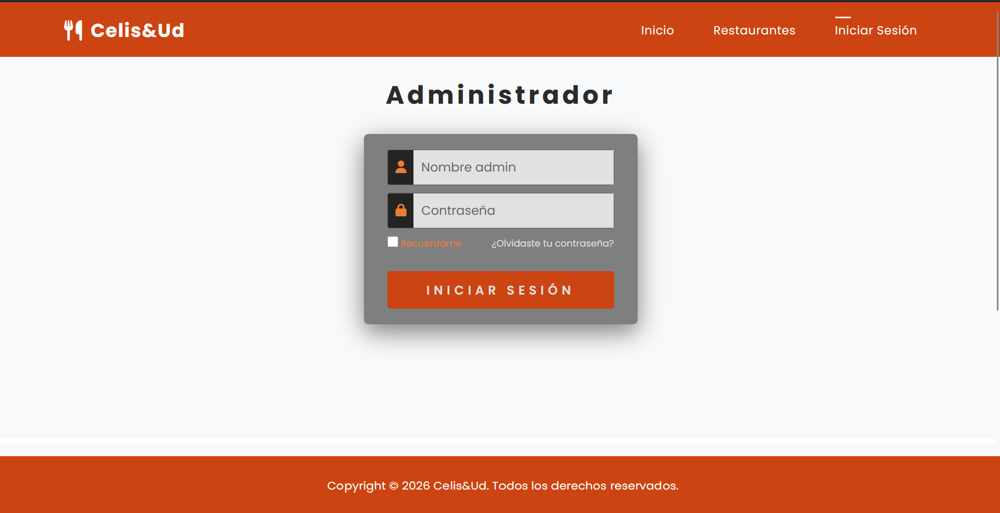

> Página que muestra al administrador un espacio en la que meter sus credenciales y si quiere ser recordado o si ha olvidado su contraseña.

#### **16. Página de registro**
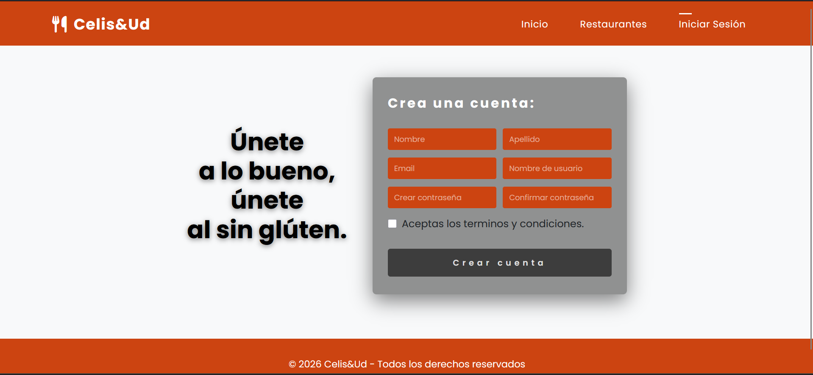

> Página en la cual se muestra un espacio en el cual el nuevo usuario debera meter los datos pertinentes para poder crearse una cuenta nueva.

#### **17. Página perfil del usuario**
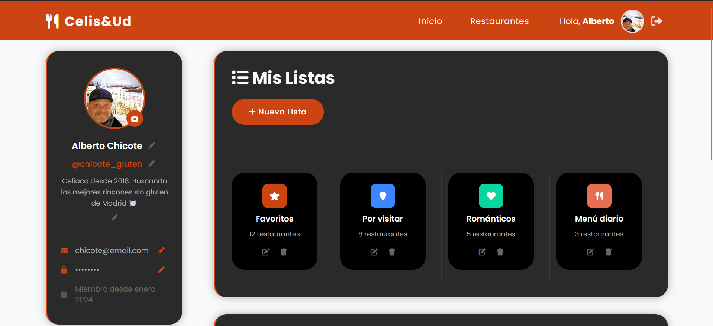
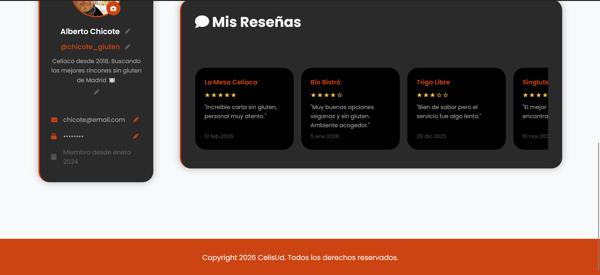

> Página en la cual se muestra el perfil del usuario, con sus  listas y sus reseñas, asi como la informacion general de este con opcion de edición de cualquier campo.


### **Participación de Miembros en la Práctica 1**

#### **Alumno 1 - Sara Torres García**

Responsable de crear las páginas de inicio de sesión, de eleccion, de usuario, de administrador, de registro de usuario y el perfil del usuario.

| Nº    | Commits      | Files      |
|:------------: |:------------:| :------------:|
|1| [Creación inicio sesión](https://github.com/CodeURJC-SSDD-2025-26/practica-ssdd-2025-26-grupo-20/commit/1fabfeba0c73d2ba5aba35b2152e4f1d2020f889)  | [iniciousuario.html](https://github.com/CodeURJC-SSDD-2025-26/practica-ssdd-2025-26-grupo-20/commit/1fabfeba0c73d2ba5aba35b2152e4f1d2020f889)   |
|2| [Edición inicio usuario](https://github.com/CodeURJC-SSDD-2025-26/practica-ssdd-2025-26-grupo-20/commit/8faaafec2a003c87c128e26db5c658c66db2d968)  | [iniciousuario.html iniciousuario.css](https://github.com/CodeURJC-SSDD-2025-26/practica-ssdd-2025-26-grupo-20/commit/8faaafec2a003c87c128e26db5c658c66db2d968)   |
|3| [Creacion inicio admin](https://github.com/CodeURJC-SSDD-2025-26/practica-ssdd-2025-26-grupo-20/commit/cb059c4812668fcda95abfbebe20c1ba9e94e3e7)  | [inicioadmin.css inicioadmin.html](https://github.com/CodeURJC-SSDD-2025-26/practica-ssdd-2025-26-grupo-20/commit/cb059c4812668fcda95abfbebe20c1ba9e94e3e7)   |
|4| [Creacion registro de usuario](https://github.com/CodeURJC-SSDD-2025-26/practica-ssdd-2025-26-grupo-20/commit/2393f2f81d2cb1a9e5aa101c12c396dca32bc63d)  | [registrarusuario.css registrarusuario.html](https://github.com/CodeURJC-SSDD-2025-26/practica-ssdd-2025-26-grupo-20/commit/2393f2f81d2cb1a9e5aa101c12c396dca32bc63d)   |
|5| [Arreglos de los inicio de usuario y admin, y union del css](https://github.com/CodeURJC-SSDD-2025-26/practica-ssdd-2025-26-grupo-20/commit/16f626b7d32507fcb8561831433c7973b6ef2831) | [inicioadmin.html iniciousuario.html registrarusuario.html iniciousuarioadmin.css](https://github.com/CodeURJC-SSDD-2025-26/practica-ssdd-2025-26-grupo-20/commit/16f626b7d32507fcb8561831433c7973b6ef2831)   |
|6| [Creacion perfil usuario](https://github.com/CodeURJC-SSDD-2025-26/practica-ssdd-2025-26-grupo-20/commit/baef2daaae344aac8385fbe09ec49bbd805aa6b1) | [perfil.html perfil.css](https://github.com/CodeURJC-SSDD-2025-26/practica-ssdd-2025-26-grupo-20/commit/baef2daaae344aac8385fbe09ec49bbd805aa6b1) |
|7| [Arreglos finales y traduccion de titulos](https://github.com/CodeURJC-SSDD-2025-26/practica-ssdd-2025-26-grupo-20/commit/32e025b7b6c5dc8244766750323ec65c6f58a7d5) | [profile.html profile.css loginuseradmin.css registeruser.css loginadmin.html loginuser.html login.html](https://github.com/CodeURJC-SSDD-2025-26/practica-ssdd-2025-26-grupo-20/commit/32e025b7b6c5dc8244766750323ec65c6f58a7d5)|

---

#### **Alumno 2 - Alexis Maestro López**

Responsable del desarrollo integral del panel de administración en colaboración con Rodrigo De Frutos Suárez. En muchos casos usando un mismo ordenador.

| Nº    | Commits      | Files      |
|:------------: |:------------:| :------------:|
|1| [modificación color interfaz y página admin](https://github.com/CodeURJC-SSDD-2025-26/ssdd-2025-26-project-base/commit/9bfd12052d3a3b9300291f691a0e54db010f126e)  | [admin.html, admin.css, index.html](https://github.com/CodeURJC-SSDD-2025-26/ssdd-2025-26-project-base/commit/9bfd12052d3a3b9300291f691a0e54db010f126e#diff-f378857c48c89c42921b1cc021e9da2a35865c1178d1eda0a2afec3c87a78c0f)   |
|2| [modificación enlaces inicio sesión](https://github.com/CodeURJC-SSDD-2025-26/ssdd-2025-26-project-base/commit/7133e64930ea607c761218af1995c97fdc86006d)  | [index.html, iniciosesion.html](https://github.com/CodeURJC-SSDD-2025-26/ssdd-2025-26-project-base/commit/7133e64930ea607c761218af1995c97fdc86006d#diff-1fcabbc07c2537428bcf441d635066cf4eb1cdfd7dfed7f7c09326bc4782ce86)   |
|3| [modificación admin](https://github.com/CodeURJC-SSDD-2025-26/ssdd-2025-26-project-base/commit/64fac34074390355d55ec0da7d4015cab71acaf0)  | [admin.html, admin.css, user-list.html, restaurantes-mod.html, municipios-mod.html](https://github.com/CodeURJC-SSDD-2025-26/ssdd-2025-26-project-base/commit/64fac34074390355d55ec0da7d4015cab71acaf0#diff-f378857c48c89c42921b1cc021e9da2a35865c1178d1eda0a2afec3c87a78c0f)   |
|4| [main admin terminado](https://github.com/CodeURJC-SSDD-2025-26/ssdd-2025-26-project-base/commit/cace287637dc4a834b10c4a43e49373b8c058024)  | [admin.html, admin.css, index.html](https://github.com/CodeURJC-SSDD-2025-26/ssdd-2025-26-project-base/commit/cace287637dc4a834b10c4a43e49373b8c058024#diff-f378857c48c89c42921b1cc021e9da2a35865c1178d1eda0a2afec3c87a78c0f)   |
|5| [lista usuarios terminada](https://github.com/CodeURJC-SSDD-2025-26/ssdd-2025-26-project-base/commit/7893de3c88c88a16d3a5c60fcc18525c527b40c5)  | [user-list.html, municipios-mod.html, user-list.css](https://github.com/CodeURJC-SSDD-2025-26/ssdd-2025-26-project-base/commit/7893de3c88c88a16d3a5c60fcc18525c527b40c5#diff-59ea846676e2f39636ad61a32f79e9af6e606ffec004b0d38e4897b5d295a080)   |
|6| [corrección](https://github.com/CodeURJC-SSDD-2025-26/ssdd-2025-26-project-base/commit/161645ba8c6eed73008e8828de06d406bf4c63e9)  | [admin.html, admin.css](https://github.com/CodeURJC-SSDD-2025-26/ssdd-2025-26-project-base/commit/161645ba8c6eed73008e8828de06d406bf4c63e9#diff-f378857c48c89c42921b1cc021e9da2a35865c1178d1eda0a2afec3c87a78c0f)   |

---

#### **Alumno 3 - Diego Iglesias Peña**

Responsable del desarrollo de las páginas principales de la web

| Nº    | Commits      | Files      |
|:------------: |:------------:| :------------:|
|1| [Plantilla+primeros cambios](https://github.com/CodeURJC-SSDD-2025-26/ssdd-2025-26-project-base/commit/312ec4aa38218fe4422e0cbac7355d365a09e846)  | [index.html](https://github.com/CodeURJC-SSDD-2025-26/ssdd-2025-26-project-base/commit/312ec4aa38218fe4422e0cbac7355d365a09e846#diff-1fcabbc07c2537428bcf441d635066cf4eb1cdfd7dfed7f7c09326bc4782ce86)   |
|2| [Pila cambios en la pag principal](https://github.com/CodeURJC-SSDD-2025-26/ssdd-2025-26-project-base/commit/bd6b54ad940bf6bf4f5f53d4d73c51b112b992f9) | [index.html](https://github.com/CodeURJC-SSDD-2025-26/ssdd-2025-26-project-base/commit/bd6b54ad940bf6bf4f5f53d4d73c51b112b992f9#diff-1fcabbc07c2537428bcf441d635066cf4eb1cdfd7dfed7f7c09326bc4782ce86)  |
|3| [Index acabado](https://github.com/CodeURJC-SSDD-2025-26/ssdd-2025-26-project-base/commit/424ac774bd1ef59c10dcd543ea74455d72323f1a)  | [templatemo-woox-travel.css](https://github.com/CodeURJC-SSDD-2025-26/ssdd-2025-26-project-base/commit/424ac774bd1ef59c10dcd543ea74455d72323f1a#diff-212448a9c086205a66b0922f7a12186fe58392dd8e4e7263b086115fa3d833c2)   |
|4| [index.html y restaurantes.html terminado](https://github.com/CodeURJC-SSDD-2025-26/ssdd-2025-26-project-base/commit/871be78b67112d6d4db8045fc0ba00243d811606) | [restaurantes.html](https://github.com/CodeURJC-SSDD-2025-26/ssdd-2025-26-project-base/commit/871be78b67112d6d4db8045fc0ba00243d811606#diff-137bc198eb169c36daff37adfa44f647e0179bb0c00afb1208c5a9d4e196aad8)   |
|5| [Add restaurant details page styles](https://github.com/CodeURJC-SSDD-2025-26/ssdd-2025-26-project-base/commit/18f19622c7c7c7ee52e29e1e645e892b88b14b4c)  | [detalles.css](https://github.com/CodeURJC-SSDD-2025-26/ssdd-2025-26-project-base/commit/18f19622c7c7c7ee52e29e1e645e892b88b14b4c#diff-d69efd3e2d86e908fa461f8942da634f2f6f2ea34fb7c6225d6829a57237264a)   |
|6| [Add restaurantes_sesioniniciada.html](https://github.com/CodeURJC-SSDD-2025-26/ssdd-2025-26-project-base/commit/1505e26ddb75b048c28d7d0fa499cbda68c21bff)  | [restaurantes_sesioniniciada.html](https://github.com/CodeURJC-SSDD-2025-26/ssdd-2025-26-project-base/commit/1505e26ddb75b048c28d7d0fa499cbda68c21bff#diff-f0814d3fbfbbce63f92f49ae40587e644df94d497374c6f7d8bf8cc200a87a48)   |
|7| [Add detalles_sesioniniciada.html](https://github.com/CodeURJC-SSDD-2025-26/ssdd-2025-26-project-base/commit/87a0a609b5c985e8368e118e5f8f302f3f8b1b54)| [detalles_sesioniniciada.html](https://github.com/CodeURJC-SSDD-2025-26/ssdd-2025-26-project-base/commit/87a0a609b5c985e8368e118e5f8f302f3f8b1b54#diff-6faa09c0cb5f79cc3964ac6477201a3fa788519a707d5b75be2bb37ed4c5a024)   |
|8| [Add restaurant details page styles](https://github.com/CodeURJC-SSDD-2025-26/ssdd-2025-26-project-base/commit/18f19622c7c7c7ee52e29e1e645e892b88b14b4c)  | [detalles.css](https://github.com/CodeURJC-SSDD-2025-26/ssdd-2025-26-project-base/commit/18f19622c7c7c7ee52e29e1e645e892b88b14b4c#diff-d69efd3e2d86e908fa461f8942da634f2f6f2ea34fb7c6225d6829a57237264a)   |
|9| [paginas principales acabadas(por revisar)](https://github.com/CodeURJC-SSDD-2025-26/ssdd-2025-26-project-base/commit/e5c4964721c73e16912f8ccb415ad4bf8a772e4a)  | [detalles.html,index_sesioniniciada.html ](https://github.com/CodeURJC-SSDD-2025-26/ssdd-2025-26-project-base/commit/e5c4964721c73e16912f8ccb415ad4bf8a772e4a#diff-6b387f7801aa1c2d4e56b74cde280f37a10e0e9506430fce98c69c2011c90b78)   |
|10| [arreglados los headers y ajustes menores](https://github.com/CodeURJC-SSDD-2025-26/ssdd-2025-26-project-base/commit/06e18f267cb8bfdd12eb4c32930885acd40699e8)  | [templatemo-woox-travel.css](https://github.com/CodeURJC-SSDD-2025-26/ssdd-2025-26-project-base/commit/06e18f267cb8bfdd12eb4c32930885acd40699e8#diff-212448a9c086205a66b0922f7a12186fe58392dd8e4e7263b086115fa3d833c2)   |
|11| [solucionado un problema con el header y algunos enlaces mal puestos](https://github.com/CodeURJC-SSDD-2025-26/ssdd-2025-26-project-base/commit/5df2a3c8e2e2f1decce5b6b6702216894ab2dc91)  | [templatemo-woox-travel.css](https://github.com/CodeURJC-SSDD-2025-26/ssdd-2025-26-project-base/commit/5df2a3c8e2e2f1decce5b6b6702216894ab2dc91#diff-212448a9c086205a66b0922f7a12186fe58392dd8e4e7263b086115fa3d833c2)   |
|12| [rename details.html, details_user.html & index.html](https://github.com/CodeURJC-SSDD-2025-26/ssdd-2025-26-project-base/commit/b293b3650d894abe3c59e020e2c3f29db1d8bf52)  | [details_user.html](https://github.com/CodeURJC-SSDD-2025-26/ssdd-2025-26-project-base/commit/b293b3650d894abe3c59e020e2c3f29db1d8bf52#diff-4af244b0654c6a41ef0a7547af5dde847aa1d58b4223969db94ccd9fa9a777ce)   |
|13| [retoques del user](https://github.com/CodeURJC-SSDD-2025-26/ssdd-2025-26-project-base/commit/3b9c43145f511cbb603e1e7ee7d6624d46f00593)  | [index_user.html](https://github.com/CodeURJC-SSDD-2025-26/ssdd-2025-26-project-base/commit/3b9c43145f511cbb603e1e7ee7d6624d46f00593#diff-93e2aff39ea78fb85b6f3b8cc42d77103008272fa11ac6a9699bc1ce22335692)   |


---

#### **Alumno 4 - Rodrigo de Frutos Suárez**

Responsable del desarrollo integral del panel de administración en colaboración con Alexis Maestro. En muchos casos usando un mismo ordenador. 

| Nº    | Commits      | Files      |
|:------------: |:------------:| :------------:|
|1| [He cambiado un poco la pagina de inicio para saber mas o menos como va a ser metiendo unos place holder](https://github.com/CodeURJC-SSDD-2025-26/ssdd-2025-26-project-base/commit/12e90d79fcdec363717b1c65f2b24e4778bc9300)  | [index.html](https://github.com/CodeURJC-SSDD-2025-26/ssdd-2025-26-project-base/commit/12e90d79fcdec363717b1c65f2b24e4778bc9300#diff-1fcabbc07c2537428bcf441d635066cf4eb1cdfd7dfed7f7c09326bc4782ce86)   |
|2| [gestion de los restaurantes, me falta extablecer bien los margenes y poner la tipografia correcta](https://github.com/CodeURJC-SSDD-2025-26/ssdd-2025-26-project-base/commit/a547071b669c3581abd32e53a02c2607a75338b0)  | [restaurantes-mod.css, restaurantes-mod.html](https://github.com/CodeURJC-SSDD-2025-26/ssdd-2025-26-project-base/commit/a547071b669c3581abd32e53a02c2607a75338b0#diff-6f04fc30b0c411c1654e4238afee1bfc2d31ba51cc1f88988b80bc192603054a)   |
|3| [Margenes de administracion de restaurantes](https://github.com/CodeURJC-SSDD-2025-26/ssdd-2025-26-project-base/commit/4114937f253fe5716da19f1a470e6a6928d6502f)  | [restaurantes-mod.css, restaurantes-mod.html](https://github.com/CodeURJC-SSDD-2025-26/ssdd-2025-26-project-base/commit/4114937f253fe5716da19f1a470e6a6928d6502f#diff-6f04fc30b0c411c1654e4238afee1bfc2d31ba51cc1f88988b80bc192603054a)   |
|4| [Ajustado el mod restaurantes para que tenga mas consistencia con el listado de usuarios.](https://github.com/CodeURJC-SSDD-2025-26/ssdd-2025-26-project-base/commit/b9b8975bf1d636592382d4290bac28c33103c921)  | [restaurantes-mod.css, restaurantes-mod.html](https://github.com/CodeURJC-SSDD-2025-26/ssdd-2025-26-project-base/commit/b9b8975bf1d636592382d4290bac28c33103c921#diff-6f04fc30b0c411c1654e4238afee1bfc2d31ba51cc1f88988b80bc192603054a)   |
|5| [Cambios de algunas clases de las tablas](https://github.com/CodeURJC-SSDD-2025-26/ssdd-2025-26-project-base/commit/e5219d413685b331eaee44c0263d19907f2938c8)  | [restaurantes-mod.html](https://github.com/CodeURJC-SSDD-2025-26/ssdd-2025-26-project-base/commit/e5219d413685b331eaee44c0263d19907f2938c8#diff-e3e62f7943c3653b00ac926892715646ae436ff7932f5d5c9b5c182fbecbbbc5)   |
|6| [Ajustes en otras clases para la parte de admin y sus css](https://github.com/CodeURJC-SSDD-2025-26/ssdd-2025-26-project-base/commit/3b448020ec53fa20964eea7bb7090ffe5b372cdb)  | [admin.html, lista-usuarios.html, restaurantes-mod.html, admin.css, lista-usuarios.css, restaurantes-mod.css](https://github.com/CodeURJC-SSDD-2025-26/ssdd-2025-26-project-base/commit/3b448020ec53fa20964eea7bb7090ffe5b372cdb#diff-f378857c48c89c42921b1cc021e9da2a35865c1178d1eda0a2afec3c87a78c0f)   |
|7| [todo hecho](https://github.com/CodeURJC-SSDD-2025-26/ssdd-2025-26-project-base/commit/ce2c9bfd4bbc3bc57bef96efda34dd21ed0f7de9)  | [lista-usuarios.html, restaurantes-mod.html, lista-usuarios.css, restaurantes-mod.css](https://github.com/CodeURJC-SSDD-2025-26/ssdd-2025-26-project-base/commit/ce2c9bfd4bbc3bc57bef96efda34dd21ed0f7de9#diff-59ea846676e2f39636ad61a32f79e9af6e606ffec004b0d38e4897b5d295a080)   |
|8| [Headers de admin](https://github.com/CodeURJC-SSDD-2025-26/ssdd-2025-26-project-base/commit/cdcf2ecda5a0f6c78b1ae1115d1786101a57e629)  | [lista-usuarios.html, lista-usuarios.css](https://github.com/CodeURJC-SSDD-2025-26/ssdd-2025-26-project-base/commit/cdcf2ecda5a0f6c78b1ae1115d1786101a57e629#diff-e426e4a80c7307b5153dc2c6b5e0a7bab7c0c8d9aee1069396086fe15d2bdb78)   |
|9| [Administra, Manin!](https://github.com/CodeURJC-SSDD-2025-26/ssdd-2025-26-project-base/commit/71e61e7a4681b4ebc82fc25630c5042d996d1496)  | [admin.html, lista-usuarios.html, admin.css, lista-usuarios.css](https://github.com/CodeURJC-SSDD-2025-26/ssdd-2025-26-project-base/commit/71e61e7a4681b4ebc82fc25630c5042d996d1496#diff-f378857c48c89c42921b1cc021e9da2a35865c1178d1eda0a2afec3c87a78c0f)   |
|10| [página admin](https://github.com/CodeURJC-SSDD-2025-26/ssdd-2025-26-project-base/commit/e96cf4e0d0852494f3265d01ae3d17c6a78c4cfc)  | [admin.html, lista-usuarios.html, lista-usuarios.html](https://github.com/CodeURJC-SSDD-2025-26/ssdd-2025-26-project-base/commit/e96cf4e0d0852494f3265d01ae3d17c6a78c4cfc#diff-f378857c48c89c42921b1cc021e9da2a35865c1178d1eda0a2afec3c87a78c0f)   |
|11| [Tablas color](https://github.com/CodeURJC-SSDD-2025-26/ssdd-2025-26-project-base/commit/25eb76cb74e9663bcb982e19b9afa3b6290eaec6)  | [admin.html, lista-usuarios.html, restaurantes.html, new-admin.css](https://github.com/CodeURJC-SSDD-2025-26/ssdd-2025-26-project-base/commit/25eb76cb74e9663bcb982e19b9afa3b6290eaec6#diff-f378857c48c89c42921b1cc021e9da2a35865c1178d1eda0a2afec3c87a78c0f)   |
|12| [Nombres, grafico, y cosas](https://github.com/CodeURJC-SSDD-2025-26/ssdd-2025-26-project-base/commit/6846dc17c128ec9f0e07e0051e15d4fba1f4df3a)  | [admin-restaurants.html, user-list.html, admin-style.css](https://github.com/CodeURJC-SSDD-2025-26/ssdd-2025-26-project-base/commit/6846dc17c128ec9f0e07e0051e15d4fba1f4df3a#diff-78706f2131de5c1dfac9c1bb894b142ce884824d4c7190cf6159de0b09778d1d)   |
|13| [Ultimos retoques](https://github.com/CodeURJC-SSDD-2025-26/ssdd-2025-26-project-base/commit/3305612594770d5f36ac4c6da3627028b30a1b36)  | [admin-restaurants.html, admin-html, user-list.html, admin-style.css](https://github.com/CodeURJC-SSDD-2025-26/ssdd-2025-26-project-base/commit/3305612594770d5f36ac4c6da3627028b30a1b36#diff-78706f2131de5c1dfac9c1bb894b142ce884824d4c7190cf6159de0b09778d1d)   |


---

## 🛠 **Práctica 2: Web con HTML generado en servidor**

### **Navegación y Capturas de Pantalla**

#### **Diagrama de Navegación**

Solo si ha cambiado.

#### **Capturas de Pantalla Actualizadas**

Solo si han cambiado.

### **Instrucciones de Ejecución**

#### **Requisitos Previos**
- **Java**: versión 21 o superior
- **Maven**: versión 3.8 o superior
- **MySQL**: versión 8.0 o superior
- **Git**: para clonar el repositorio

#### **Pasos para ejecutar la aplicación**

1. **Clonar el repositorio**
   ```bash
   git clone https://github.com/[usuario]/[nombre-repositorio].git
   cd [nombre-repositorio]
   ```

2. **AQUÍ INDICAR LO SIGUIENTES PASOS**

#### **Credenciales de prueba**
- **Usuario Admin**: usuario: `admin`, contraseña: `admin`
- **Usuario Registrado**: usuario: `user`, contraseña: `user`

### **Diagrama de Entidades de Base de Datos**

Diagrama mostrando las entidades, sus campos y relaciones:

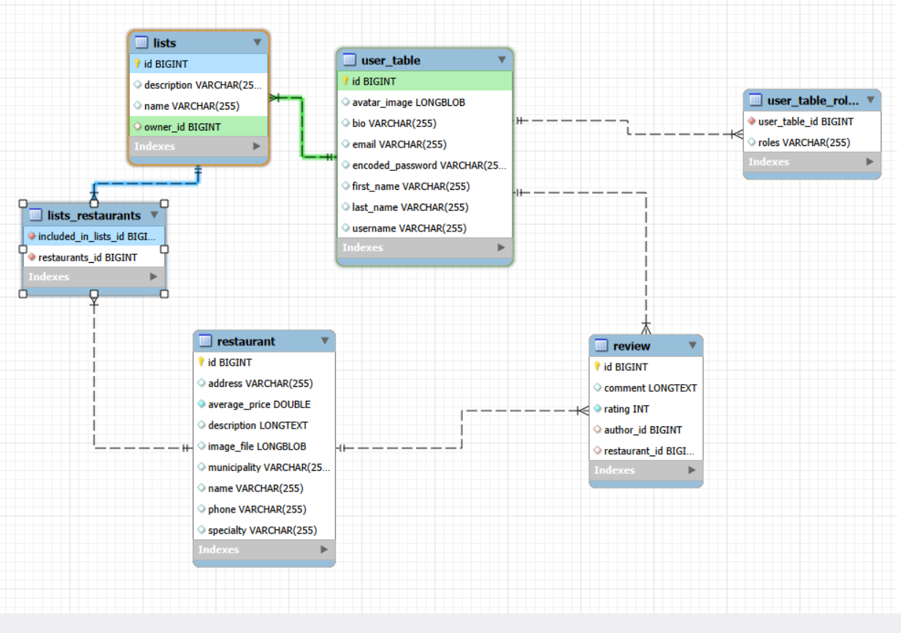

> [Descripción opcional: Ej: "El diagrama muestra las 4 entidades principales: Usuario, Producto, Pedido y Categoría, con sus respectivos atributos y relaciones 1:N y N:M."]

### **Diagrama de Clases y Templates**

Diagrama de clases de la aplicación con diferenciación por colores o secciones:

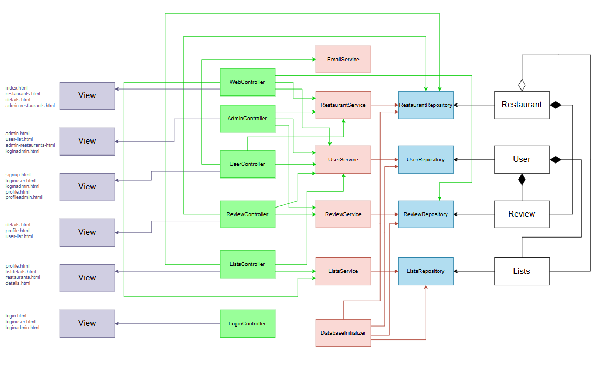

> [Descripción opcional del diagrama y relaciones principales]

### **Participación de Miembros en la Práctica 2**

#### **Alumno 1 - Sara Torres García**

Encargada de la entidad de restaurantes, buscador por municipios y especialidad, así como la creacion de estos, editar y eliminar.

| Nº    | Commits      | Files      |
|:------------: |:------------:| :------------:|
|1| [Test sobre la entidad de restaurantes.](https://github.com/CodeURJC-SSDD-2025-26/ssdd-2025-26-project-base/commit/c44e5ba85b6220fe799be9e108b81a81e2bbaed5)  | [AdminController.java, WebController.java, RestaurantRepository.java, RestaurantService.java, AdminControllerTest.java, WebControllerTest.java, RestaurantRepositoryTest.java, RestaurantServiceTest.java](https://github.com/CodeURJC-SSDD-2025-26/ssdd-2025-26-project-base/commit/c44e5ba85b6220fe799be9e108b81a81e2bbaed5#diff-65701efcfc13c776b08b2a10a7ff7226982a42944b79527f6b5a0ccbbc7bc78c)   |
|2| [Cambios para la realizacion del buscador en restaurantes.](https://github.com/CodeURJC-SSDD-2025-26/ssdd-2025-26-project-base/commit/a9e2187a33b599ba0db371c64841adf0dd41c7ed)  | [WebController.java, RestaurantRepository.java, SecurityConfig.java, RestaurantService.java, restaurants.html, RestaurantRepositoryTest.java](https://github.com/CodeURJC-SSDD-2025-26/ssdd-2025-26-project-base/commit/a9e2187a33b599ba0db371c64841adf0dd41c7ed#diff-834fb1466b70eea5b7cff1bc617cde978adc1793026b863426ed102e69ef29e2)   |
|3| [Inicio de cambios en crear restaurantes y cambio de imagenes estaticas.](https://github.com/CodeURJC-SSDD-2025-26/ssdd-2025-26-project-base/commit/95dc595258264368dd625540444d9888b614ab68)  | [AdminController.java, WebController.java, SecurityConfig.java, admin-restaurants.html, index.html, restaurants.html](https://github.com/CodeURJC-SSDD-2025-26/ssdd-2025-26-project-base/commit/95dc595258264368dd625540444d9888b614ab68#diff-65701efcfc13c776b08b2a10a7ff7226982a42944b79527f6b5a0ccbbc7bc78c)   |
|4| [Resuelto el rpoblema del buscador en index y restaurantes.](https://github.com/CodeURJC-SSDD-2025-26/ssdd-2025-26-project-base/commit/1de69e64ff06907d5e84928cf2cd108308cf2ea4)  | [AdminController.java, SecurityConfig.java, index.html, restaurants.html](https://github.com/CodeURJC-SSDD-2025-26/ssdd-2025-26-project-base/commit/1de69e64ff06907d5e84928cf2cd108308cf2ea4#diff-65701efcfc13c776b08b2a10a7ff7226982a42944b79527f6b5a0ccbbc7bc78c)   |
|5| [Ayuda con el funcionamiento de las reseñas en los restaurantes.](https://github.com/CodeURJC-SSDD-2025-26/ssdd-2025-26-project-base/commit/afb83eacfe0fc253a8c5924df56fa45de3ded1a4)  | [WebController.java, ReviewRepository.java, DataBaseInitializer.java, index.html](https://github.com/CodeURJC-SSDD-2025-26/ssdd-2025-26-project-base/commit/afb83eacfe0fc253a8c5924df56fa45de3ded1a4#diff-834fb1466b70eea5b7cff1bc617cde978adc1793026b863426ed102e69ef29e2)   |
|6| [Finalizacion de crear, editar y eliminar restaurantes, así como las imagenes dinámicas en index y restaurantes.](https://github.com/CodeURJC-SSDD-2025-26/ssdd-2025-26-project-base/commit/8d004f738b27abd7389c654b35f569f0d0e39048#diff-65701efcfc13c776b08b2a10a7ff7226982a42944b79527f6b5a0ccbbc7bc78c)  | [AdminController.java, WebController.java, Restaurant.java, ListsRepository.java, ReviewRepository.java, SecurityConfig.java, RestaurantService.java, admin-restaurants.html, index.html, restaurants.html](https://github.com/CodeURJC-SSDD-2025-26/ssdd-2025-26-project-base/commit/8d004f738b27abd7389c654b35f569f0d0e39048#diff-65701efcfc13c776b08b2a10a7ff7226982a42944b79527f6b5a0ccbbc7bc78c)   |

---


#### **Alumno 2 - Alexis Maestro López**

[Descripción de las tareas y responsabilidades principales del alumno en el proyecto]

| Nº    | Commits      | Files      |
|:------------: |:------------:| :------------:|
|1| [actualización parte usuarios](https://github.com/CodeURJC-SSDD-2025-26/practica-ssdd-2025-26-grupo-20/commit/8b533f647d229aa8d0d1f002c09890b1129cec96)  | [AdminController.java, LoginController.java, UserController.java, WebController.java, User.java](src/main/java/es/urjc/controllers/AdminController.java)   |
|2| [corrección usuarios](https://github.com/CodeURJC-SSDD-2025-26/practica-ssdd-2025-26-grupo-20/commit/1665e97b4d4b14d7701f12d474f4f08168715791)  | [assets, vendor](‎src/main/resources/static/templatemo_580_woox_travel)   |
|3| [cambios interfaz usuario](https://github.com/CodeURJC-SSDD-2025-26/practica-ssdd-2025-26-grupo-20/commit/84427b515715d174d50ee96cfee24861e7067594)  | [WebController.java, SecurityConfig.java, index.html, restaurants.html](‎src/main/java/es/urjc/controllers/WebController.java)   |
|4| [merge](https://github.com/CodeURJC-SSDD-2025-26/practica-ssdd-2025-26-grupo-20/commit/f5c4891c7b149a788b64634feb4ed7c58c0c672a)  | [AdminController.java, LoginController.java, UserController.java, WebController.java, DatabaseInitializer.java](src/main/java/es/urjc/controllers/AdminController.java)   |
|5| [corrección inicio sesión admin](https://github.com/CodeURJC-SSDD-2025-26/practica-ssdd-2025-26-grupo-20/commit/4237853b18d8b9a618250c923c2faaa284047025)  | [AdminController.java, login.html, loginadmin.html, loginuser.html](src/main/resources/templates/login.html)   |
|6| [avance página administradores y corrección perfil](https://github.com/CodeURJC-SSDD-2025-26/practica-ssdd-2025-26-grupo-20/commit/76b27192f2804cb29cf18db38c2bf769000d0298)  | [LoginController.java, UserController.java, WebController.java, SecurityConfig.java, admin.html, user-list.html, loginuser.html, loginadmin.html, profile.html](src/main/java/es/urjc/controllers/LoginController.java) |
|7| [correcciones y envío de email casi completado](https://github.com/CodeURJC-SSDD-2025-26/practica-ssdd-2025-26-grupo-20/commit/101c0965acddb82e56a0c06fdc8ee1098c558ac4)  | [pox.xml, EmailService.java, application.properties, UserController.java](src/main/java/es/urjc/services/EmailService.java) |
|8| [envío de email implementado correctamente](https://github.com/CodeURJC-SSDD-2025-26/practica-ssdd-2025-26-grupo-20/commit/0c1afc5e4e2043c866c620acd01e8eb84c96caad)  | [pom.xml, application.properties](src/main/resources/application.properties) |
|9| [corrección headers de restaurantes (detalles) y listas](https://github.com/CodeURJC-SSDD-2025-26/practica-ssdd-2025-26-grupo-20/commit/2462e79adb576f7aaff694189074e0fce40b645a)  | [ListsController.java, WebController.java](src/main/java/es/urjc/controllers/ListsController.java) |
|10| [corrección encabezado lista de usuarios y redirección al eliminar tu propia cuenta](https://github.com/CodeURJC-SSDD-2025-26/practica-ssdd-2025-26-grupo-20/commit/7ceef1501376319d3214cd043c250f09024d1fe6)  | [UserController.java, user-list.html](src/main/java/es/urjc/controllers/UserController.java) |

---

#### **Alumno 3 - Diego Iglesias Peña**

Encargado de la entidad Listas. 
También encargado de realizar los merges de las ramas de mis compañeros.

| Nº    | Commits      | Files      |
|:------------: |:------------:| :------------:|
|1| [Lists funcions](https://github.com/CodeURJC-SSDD-2025-26/practica-ssdd-2025-26-grupo-20/commit/b1162f06efc32f31e1aa01db66953827da489a5d)  | [ListsController.java](src/main/java/es/urjc/controllers/ListsController.java)   |
|2| [html updates to have dinamic lists](https://github.com/CodeURJC-SSDD-2025-26/practica-ssdd-2025-26-grupo-20/commit/5e15515a2c37a93f445b5c63a2681f8e40d42ec5)  | [details.html,restaurants.html,index.html,profile.html](src/main/resources/static/templatemo_580_woox_travel/details.html)   |
|3| [functional add and delete lists from profile](https://github.com/CodeURJC-SSDD-2025-26/practica-ssdd-2025-26-grupo-20/commit/16be9bcf910688bfff8f129972f23f44b60466c3)  | [ListsController.java](src/main/java/es/urjc/controllers/ListsController.java)   |
|4| [add and delete restaurants from lists functional](https://github.com/CodeURJC-SSDD-2025-26/practica-ssdd-2025-26-grupo-20/commit/7b6dbb0e9a6432c3f8fedb8b2505b909b24f3f38)  | [ListsController.java](src/main/java/es/urjc/controllers/ListsController.java)   |
|5| [Merge pull request #2 from CodeURJC-SSDD-2025-26/Reviews](https://github.com/CodeURJC-SSDD-2025-26/practica-ssdd-2025-26-grupo-20/commit/5c02cc655e84e22fde4725547f2570cd3a4ff710)  | Branch Reviews   |
|6| [Merge pull request #3 from CodeURJC-SSDD-2025-26/restauranttest2](https://github.com/CodeURJC-SSDD-2025-26/practica-ssdd-2025-26-grupo-20/commit/1b4a6c2cf6cd23c2b6c6019f65b0befafc4cda67)  | Branch restauranttest]   |
|7| [added alexis branch](https://github.com/CodeURJC-SSDD-2025-26/practica-ssdd-2025-26-grupo-20/commit/7471be5f94a1ba252648a0f5e097a0d9949d248c)  | Branch feature-usuarios(hubo un problema con el merge)  |
|8| [fixed a bug where you cant delete lists](https://github.com/CodeURJC-SSDD-2025-26/practica-ssdd-2025-26-grupo-20/commit/b68a1291c92a2924f876a4a0c2db15390907be6d)  | [ListsController.java](src/main/java/es/urjc/controllers/ListsController.java)   |
|9| [lists bugs fixed](https://github.com/CodeURJC-SSDD-2025-26/practica-ssdd-2025-26-grupo-20/commit/5d6487c0e2bc5c016bcede4d60ede37b6bf07dd4)  | [index.html,details.html,restaurants.html](src/main/resources/templates/index.html)   |
|10| [added error page](https://github.com/CodeURJC-SSDD-2025-26/practica-ssdd-2025-26-grupo-20/commit/f1ef43c0574fde6ee928874c39c11e41d2891e0b)  | [error.html,CustomErrorController.java](src/main/java/es/urjc/controllers/CustomErrorController.java)   |

---

#### **Alumno 4 - Rodrigo de Frutos Suárez**

[Descripción de las tareas y responsabilidades principales del alumno en el proyecto]

| Nº    | Commits      | Files      |
|:------------: |:------------:| :------------:|
|1| [De las reseñas hecho crear y borrar reseñas](https://github.com/CodeURJC-SSDD-2025-26/practica-ssdd-2025-26-grupo-20/commit/36460f2a33606aef9c8ef2baec6da62d5a93db73)  | [ReviewController.java, ReviewService.java, ReviewServiceTest.java](https://github.com/CodeURJC-SSDD-2025-26/practica-ssdd-2025-26-grupo-20/commit/36460f2a33606aef9c8ef2baec6da62d5a93db73#diff-c3078f136673113171ce77066c33799ad19420b1d84bf593f2a5f66095f1d265)   |
|2| [Controlador, graficos y mas](https://github.com/CodeURJC-SSDD-2025-26/practica-ssdd-2025-26-grupo-20/commit/294de16072d8870b63b962dcbf49628dbfd4e706)  | [ReviewController.java, ReviewRepository.java, ReviewService.java, admin-restaurants.html, ReviewServiceTest.java](https://github.com/CodeURJC-SSDD-2025-26/practica-ssdd-2025-26-grupo-20/commit/294de16072d8870b63b962dcbf49628dbfd4e706#diff-c3078f136673113171ce77066c33799ad19420b1d84bf593f2a5f66095f1d265)   |
|3| [Botones de editar y borrar reseñas propias](https://github.com/CodeURJC-SSDD-2025-26/practica-ssdd-2025-26-grupo-20/commit/da733e68a446929854580a61a1ff03f5d1da0e84)  | [ReviewController.java, ReviewService.java, DatabaseInitializer.java, application.properties, profile.html](https://github.com/CodeURJC-SSDD-2025-26/practica-ssdd-2025-26-grupo-20/commit/da733e68a446929854580a61a1ff03f5d1da0e84#diff-c3078f136673113171ce77066c33799ad19420b1d84bf593f2a5f66095f1d265)   |
|4| [Assets publicos](https://github.com/CodeURJC-SSDD-2025-26/practica-ssdd-2025-26-grupo-20/commit/0caed92ac84f9681a09587f7da2c8845d9d56fd3)  | [SecurityConfig.java](https://github.com/CodeURJC-SSDD-2025-26/practica-ssdd-2025-26-grupo-20/commit/0caed92ac84f9681a09587f7da2c8845d9d56fd3#diff-f2ebbfdc5732be658e63be206c44e3946c3cfd27f811d61d8e61866f0755702c)   |
|5| [Publicar y editar reseñas funcional](https://github.com/CodeURJC-SSDD-2025-26/practica-ssdd-2025-26-grupo-20/commit/0b84a32e44177d69d84362a4f756e3fd3c042700)  | [UserController.java, Review.java, details.html, profile.html](https://github.com/CodeURJC-SSDD-2025-26/practica-ssdd-2025-26-grupo-20/commit/0b84a32e44177d69d84362a4f756e3fd3c042700#diff-3b176303e9fbdcb147c2b778217f68dc665910d7b85954adda5678850db00563)   |
|6| [Eliminar reseñas FUNCIONA](https://github.com/CodeURJC-SSDD-2025-26/practica-ssdd-2025-26-grupo-20/commit/ed7e183f588805df920b71351d62d4f2bd2fe020)  | [ReviewController.java, ReviewService.java](https://github.com/CodeURJC-SSDD-2025-26/practica-ssdd-2025-26-grupo-20/commit/ed7e183f588805df920b71351d62d4f2bd2fe020#diff-c3078f136673113171ce77066c33799ad19420b1d84bf593f2a5f66095f1d265)   |
|7| [Funcion de eliminar reseña para admin](https://github.com/CodeURJC-SSDD-2025-26/practica-ssdd-2025-26-grupo-20/commit/bbfae3b10c7e98fa24970eec2783baf9ce959ebf)  | [ReviewController.java, ReviewService.java, user-list.html, details.html](https://github.com/CodeURJC-SSDD-2025-26/practica-ssdd-2025-26-grupo-20/commit/bbfae3b10c7e98fa24970eec2783baf9ce959ebf#diff-c3078f136673113171ce77066c33799ad19420b1d84bf593f2a5f66095f1d265)   |

---

## 🛠 **Práctica 3: API REST, docker y despliegue**

### **Documentación de la API REST**

#### **Especificación OpenAPI**
📄 **[Especificación OpenAPI (YAML)](/api-docs/api-docs.yaml)**

#### **Documentación HTML**
📖 **[Documentación API REST (HTML)](https://raw.githack.com/[usuario]/[repositorio]/main/api-docs/api-docs.html)**

> La documentación de la API REST se encuentra en la carpeta `/api-docs` del repositorio. Se ha generado automáticamente con SpringDoc a partir de las anotaciones en el código Java.

### **Diagrama de Clases y Templates Actualizado**

Diagrama actualizado incluyendo los @RestController y su relación con los @Service compartidos:


### **Instrucciones de Ejecución con Docker**

#### **Requisitos previos:**
- Docker instalado (versión 20.10 o superior)
- Docker Compose instalado (versión 2.0 o superior)

#### **Pasos para ejecutar con docker-compose:**

1. **Clonar el repositorio** (si no lo has hecho ya):
   ```bash
   git clone https://github.com/[usuario]/[repositorio].git
   cd [repositorio]
   ```

2. **AQUÍ LOS SIGUIENTES PASOS**:

### **Construcción de la Imagen Docker**

#### **Requisitos:**
- Docker instalado en el sistema

#### **Pasos para construir y publicar la imagen:**

1. **Navegar al directorio de Docker**:
   ```bash
   cd docker
   ```

2. **AQUÍ LOS SIGUIENTES PASOS**

### **Despliegue en Máquina Virtual**

#### **Requisitos:**
- Acceso a la máquina virtual (SSH)
- Clave privada para autenticación
- Conexión a la red correspondiente o VPN configurada

#### **Pasos para desplegar:**

1. **Conectar a la máquina virtual**:
   ```bash
   ssh -i [ruta/a/clave.key] [usuario]@[IP-o-dominio-VM]
   ```
   
   Ejemplo:
   ```bash
   ssh -i ssh-keys/app.key vmuser@10.100.139.XXX
   ```

2. **AQUÍ LOS SIGUIENTES PASOS**:

### **URL de la Aplicación Desplegada**

🌐 **URL de acceso**: `https://[nombre-app].etsii.urjc.es:8443`

#### **Credenciales de Usuarios de Ejemplo**

| Rol | Usuario | Contraseña |
|:---|:---|:---|
| Administrador | admin | admin123 |
| Usuario Registrado | user1 | user123 |
| Usuario Registrado | user2 | user123 |

### **OTRA DOCUMENTACIÓN ADICIONAL REQUERIDA EN LA PRÁCTICA**

### **Participación de Miembros en la Práctica 3**

#### **Alumno 1 - [Nombre Completo]**

[Descripción de las tareas y responsabilidades principales del alumno en el proyecto]

| Nº    | Commits      | Files      |
|:------------: |:------------:| :------------:|
|1| [Descripción commit 1](URL_commit_1)  | [Archivo1](URL_archivo_1)   |
|2| [Descripción commit 2](URL_commit_2)  | [Archivo2](URL_archivo_2)   |
|3| [Descripción commit 3](URL_commit_3)  | [Archivo3](URL_archivo_3)   |
|4| [Descripción commit 4](URL_commit_4)  | [Archivo4](URL_archivo_4)   |
|5| [Descripción commit 5](URL_commit_5)  | [Archivo5](URL_archivo_5)   |

---

#### **Alumno 2 - [Nombre Completo]**

[Descripción de las tareas y responsabilidades principales del alumno en el proyecto]

| Nº    | Commits      | Files      |
|:------------: |:------------:| :------------:|
|1| [Descripción commit 1](URL_commit_1)  | [Archivo1](URL_archivo_1)   |
|2| [Descripción commit 2](URL_commit_2)  | [Archivo2](URL_archivo_2)   |
|3| [Descripción commit 3](URL_commit_3)  | [Archivo3](URL_archivo_3)   |
|4| [Descripción commit 4](URL_commit_4)  | [Archivo4](URL_archivo_4)   |
|5| [Descripción commit 5](URL_commit_5)  | [Archivo5](URL_archivo_5)   |

---

#### **Alumno 3 - [Nombre Completo]**

[Descripción de las tareas y responsabilidades principales del alumno en el proyecto]

| Nº    | Commits      | Files      |
|:------------: |:------------:| :------------:|
|1| [Descripción commit 1](URL_commit_1)  | [Archivo1](URL_archivo_1)   |
|2| [Descripción commit 2](URL_commit_2)  | [Archivo2](URL_archivo_2)   |
|3| [Descripción commit 3](URL_commit_3)  | [Archivo3](URL_archivo_3)   |
|4| [Descripción commit 4](URL_commit_4)  | [Archivo4](URL_archivo_4)   |
|5| [Descripción commit 5](URL_commit_5)  | [Archivo5](URL_archivo_5)   |

---

#### **Alumno 4 - [Nombre Completo]**

[Descripción de las tareas y responsabilidades principales del alumno en el proyecto]

| Nº    | Commits      | Files      |
|:------------: |:------------:| :------------:|
|1| [Descripción commit 1](URL_commit_1)  | [Archivo1](URL_archivo_1)   |
|2| [Descripción commit 2](URL_commit_2)  | [Archivo2](URL_archivo_2)   |
|3| [Descripción commit 3](URL_commit_3)  | [Archivo3](URL_archivo_3)   |
|4| [Descripción commit 4](URL_commit_4)  | [Archivo4](URL_archivo_4)   |
|5| [Descripción commit 5](URL_commit_5)  | [Archivo5](URL_archivo_5)   |

---
